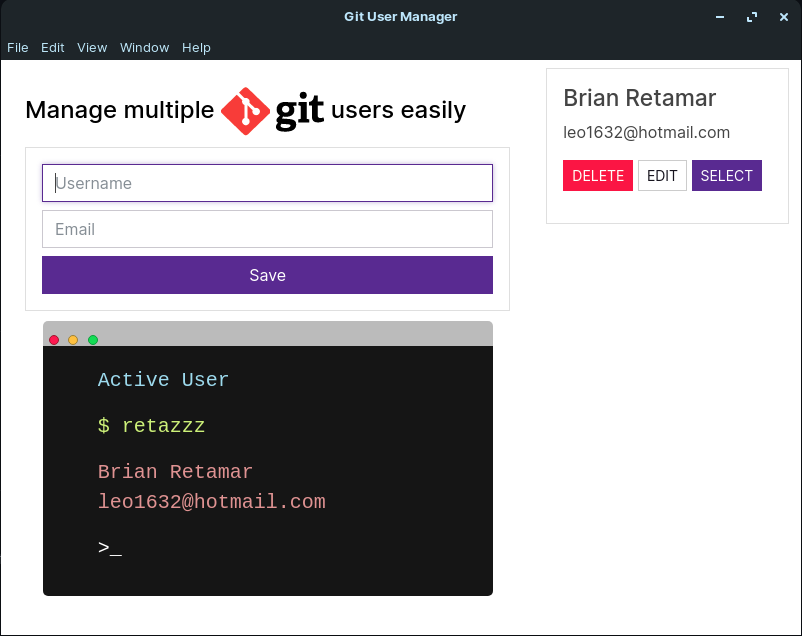

## GIT User Manager

Git User Manager

## Table of contents

- [General info](#general-info)
- [Screenshots](#screenshots)
- [Technologies](#technologies)
- [How to run](#how-to-run)
- [Contact](#contact)

## General info

An Electron.js app to manage multiple GIT local users. Switch between them quickly.

## Screenshots



## Technologies

- Html
- Css
- Javascript
- Node.js
- Electron.js
- SQLite

## How to run

Note: You have to have [GIT](https://git-scm.com) installed on your computer 

1. Install [Node.js](https://nodejs.org/) v14+ to run.
2. Clone the repository
3. Open a terminal and navigate to the root project folder
4. Now run ```npm install``` to install all dependencies
5. Finally run ```npm start``` to run the app

## Contact

Created by [@retaLazyCodes](https://github.com/retaLazyCodes) - feel free to contact me!
